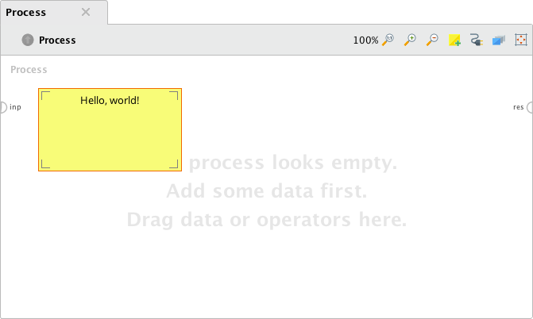
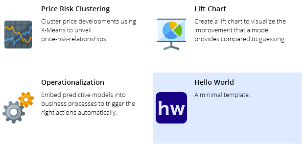
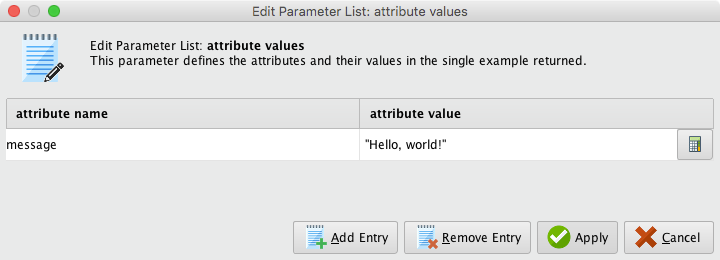
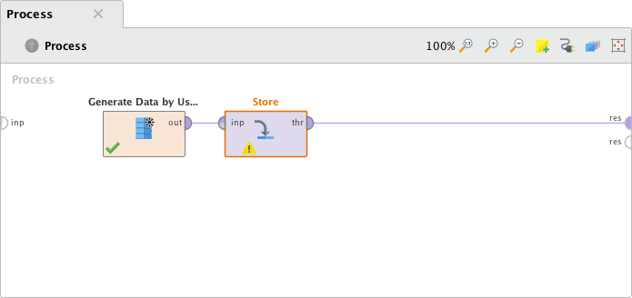
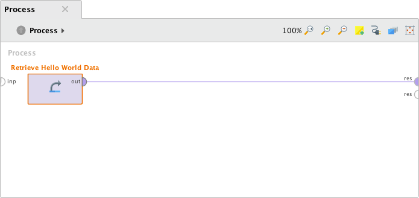
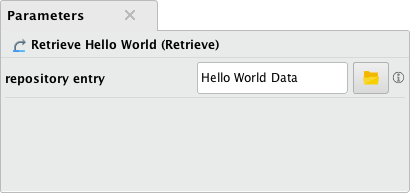
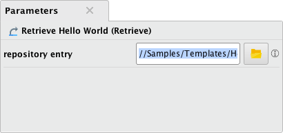

# How to create custom templates

As extension developer you can provide both your own templates and tutorials.
Templates are processes that serve as starting point for complex workflows and can be selected from the _New Process_ menu.
A tutorial is a series of processes accompanied by explanatory texts that can be used to introduce new functionality step by step.
Tutorials can be started via the _Learn_ menu.

This article will guide you through:

* Designing a new template process
* Bundling the template with your extension

## Designing a template

Templates are self-contained files that can be distributed via extensions or loaded from your local file system.
While the file format is simple, it is important to comply with the structure described below.

### File format

Templates are ZIP archives that use the ```.template``` file extension and contain at least three files:

````
my_template.template 
├── icon.png
├── My Template.rmp
└── template.properties
````

The ```template.properties``` files defines the name of the template and contains a short description.
It must be encoded as ```ISO-8859-1``` – in particular, unicode encodings will most likely not work.
For the example above, the file's contents could be like this:

```
template.name=My Template
template.short_description=This is my custom template.
```

The template must contain exactly one RapidMiner process (```*.rmp```).
Its file name must match the template name specified in the properties file.

The icon that should be used for the template, e.g., in the _New Process_ menu, 
must be provided as portable network graphic (```*.png```), named ```icon.png```, and should be of size 64×64.

In addition to these files, you can bundle arbitrary repository entries. 
For instance, if you want to include a certain data set in your template,
you can do so by adding the corresponding files from your local repository.
The following section covers an example for this.

Finally, please note that the template mechanism does not support subdirectories.
RapidMiner Studio will refuse to load template archives that include folders.

### Developing templates

You can load your template processes locally without bundling them with your extension.
The latter becomes only necessary if you want to distribute your templates.

All you need to do is to move the template archive into your ```.RapidMiner\templates``` directory.
Please note that templates stored in that directory override bundled templates:
if you bundle a template with your extension and have a local copy of the template installed,
only the local copy will loaded.

#### A minimal template

Let us start with a simple _“Hello, world!”_ template that displays a single process annotation.
To create the process file open a new process in RapidMiner Studio and add an annotation with a message of your liking:



Export the process via the _File_ menu (chose _Export Process…_) and save it as ```Hello World.rmp```.

Next we need a template icon in the correct format.
If you like, you can download this one:


As last file, we need to create the ```template.properties``` file that ties everything together.
It is important that the specified template name matches the process name (without the ```*.rmp``` extension):

```
template.name=Hello World
template.short_description=A minimal template.
```

Finally, we need to create the template archive.
For this purpose, create a new ZIP archive containing the three files using an archiver of yor choice.
Then change the file extension from ```*.zip``` to ```*.template```, e.g., rename ```hello_world.zip``` to ```hello_world.template```.
The final file structure should be like this:

```
hello_world.template 
├── Hello World.rmp
├── icon.png
└── template.properties
```

To load the newly created template, copy the template file to ```.RapidMiner/templates``` and restart RapidMiner Studio.
In the _New Process_ menu, you should now be able to select the your new template:



Selecting the new entry should open up the process we created in the first step.

#### Including repository entries

Let us now add a custom data set to the template.
In principle, you can bundle any repository entry with a template.
But keep in mind that the template mechanism is not designed to handle large data sets.

Before we start, let us revisit how RapidMiner processes reference repository entries.
This is either done via an absolute path, e.g., ```//Local Repository/data/example``` or via relative paths, e.g., ```../data/example```.

For templates we can use neither:
While absolute paths will work on the machine that you use to develop the template, the paths will most likely be invalid on other machines.
Relative paths will not work at all, since the template mechanism always creates a new process that has no repository location to begin with.

However, RapidMiner Studio will create a hidden samples repository for each template.
For instance, the contents of our _“Hello, world!”_ template are available via the absolute path ```//Samples/Templates/Hello World```.
Thus, we will have to adjust repository references in our template processes accordingly. 

First, create a new folder in your local repository, e.g., ```//Local Repository/Hello World```.
Then create a new process and drag in the _Generate Data by User Specification_ operator and specify a small data set:



Add a _Store_ operator to save the specified data set.
Configure it to store the data set in the directory created above, e.g., as ```//Local Repository/Hello World/Hello World Data```:



Run the process once to create the repositor entry.

Create a new process and store it in the same directory as the data set, e.g., as ```//Local Repository/Hello World/Hello World```.
Drag the data set into the blank process and connect the _Retrieve_ operator to the results port:



Once you save the process, the repository entry will be referenced via a relative path:



Changes this to ```//Samples/Templates/Hello World/Hello World Data``` (this assumes that we continue with the template name _Hello World_):



RapidMiner Studio might warn you about in invalid path since the template has not been loaded yet.
Ignore the warning and save the process.

Your local repository should now have a structure similar to this:

```
Local Repository
├── data
├── processes
├── …
├── Hello World
│   ├── Hello World Data
│   └── Hello World
└── …
```

If you browse the repository with your operating system's file browser, you will get a slightly different picture.
To do so, alternative-click on the repository an chose _Open in file browser_:

```
.RapidMiner/repositories/Local Repository
├── …
├── Hello World
│   ├── Hello World Data.ioo
│   ├── Hello World Data.md
│   ├── Hello World Data.properties
│   ├── Hello World.properties
│   └── Hello World.rmp
└── …
```

As you can see the generated data set is split into three files.
It is important that we bundle both the ```*.ioo``` (the actual data) and the ```*.md``` (meta data) with the template.
However, we can ignore the ```*.properties``` files.

Update the template archive created in the previous section and add the generated data set. 
The archive should now look like this:

```
hello_world.template 
├── Hello World Data.ioo
├── Hello World Data.md
├── Hello World.rmp (updated process)
├── icon.png
└── template.properties
```

Restart RapidMiner Studio to load the updated template.
You should be able to run the template without having to modify the process.

### Bundling templates

Bundling templates with your extension is a straight forward process.
All you have to do is to add your template archives as resources and register them in the initialization code of your extension.

If you have no experience with writing extensions yet, please refer to out [Building RapidMiner Extensions ](http://docs.rapidminer.com/downloads/RapidMiner-extensions.pdf) guide (PDF).
Chapters 1-3 cover all you need to know to build an extension that can be used to distribute templates.

#### Adding templates as resources

By convention build tools such as Maven and Gradle look for resources in the ```src/main/resources``` directory.
We recommend using this structure for RapidMiner extensions as well.

Let us assume that you chose ```org.myorg.myextension``` as group id.
Then your resources should be located under ```src/main/resources/org/myorg/myextension```.
Note that RapidMiner will add the ```template``` directory to the path automatically.
Thus, you could bundle the template create above as ```…/org/myorg/myextension/template/hello_world.template```:

```
my_extension
├── README.md
├── build.gradle
├── …
├── src
│   └── main
│       ├── java
│       │   └── …
│       └── resources
│           ├── org
│           │   └── myorg
│           │       └── myextension
│           │           └── template
│           │               └── hello_world.template
│           └── …
└── …
```

However, RapidMiner will not search for resources in that directory unless you register the location as resource source.
This can be easily done in the initialization code of your extension.
All you need to do is to add the following line to the ```initPlugin()``` method:

```Java
/**
 * This method will be called directly after the extension is initialized. This is the first
 * hook during start up. No initialization of the operators or renderers has taken place when
 * this is called.
 */
public static void initPlugin() {
    // register extension resources
    Tools.addResourceSource(new ResourceSource(PluginInitMyExtension.class.getClassLoader(), 
        "org/myorg/myextension/"));
}
```

Now you can register extension via the so-called template manager.
To register the template designed above, you could add another line to the plugin initialization code:

```Java
public static void initPlugin() {
    // register extension resources
    Tools.addResourceSource(new ResourceSource(PluginInitMyExtension.class.getClassLoader(), 
        "org/myorg/myextension/"));
    // register hello world template
    TemplateManager.INSTANCE.registerTemplate("hello_world");
}
```

#### Testing the templates

There are no further special steps involved in testing the bundled templates.
All you need to do is to build a new version of your extension, e.g., via the command ```gradle clean installExtension```.

But keep in mind that templates stored in your ```.RapidMiner``` directory override bundled template of the same name.
Thus, make sure to remove all working copies of your templates before starting RapidMiner Studio.